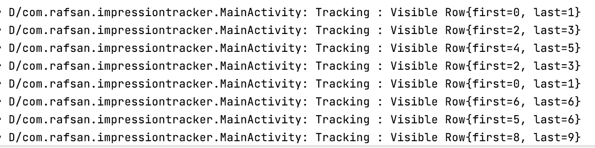
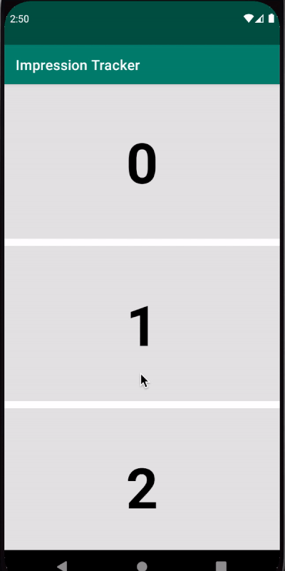

# Android Impression-Tracker
A sample application to show the implementation of tracking Recyclerview item visibility for a specified interval.

## App's Functionality

1. Show a recyclerview with a dummy list.
2. Add an `onScrollListener` on recyclerview to track items.
3. Using `RxJava`, `RxAndroid`, `LayoutManager` to track currently visible rows on the screen.
4. Only track recyclerview items - if visible for a specified interval. For example - 500 `Milliseconds`.
5. Return visible rows index position in the `callback` & get currently visible rows data - which then can be sent to a remote database for saving.
6. Update recyclerview adapter holder background based on tracking logic.

## ImpressionTracker.kt

This class is responsible for tracking the recyclerview items.

The class uses RxJava `disposable`, `distinctUntilChanged`. `throttle` operator on a subject to track its visibility.

## VisibleRows.kt

This class holds the information about the currently visible rows by implementing `findFirstCompletelyVisibleItemPosition` & `findLastCompletelyVisibleItemPosition` on Recyclerview `LayoutManager`.

## Building

You can open the project in Android studio and press run.
Android Studio version used to build the project: Arctic fox 2020.3.1

Gradle plugin used in the project will require `Java 11.0` to run.

you can set the gradle jdk in `Preferences->Build Tools->Gradle->Gradle JDK`

## Logcat

# Demo

